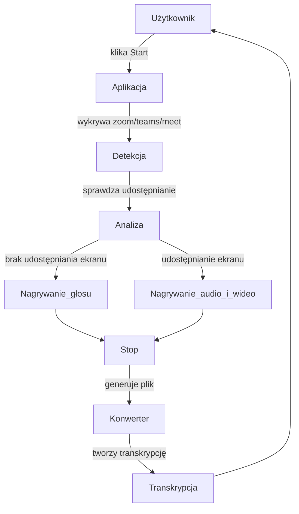
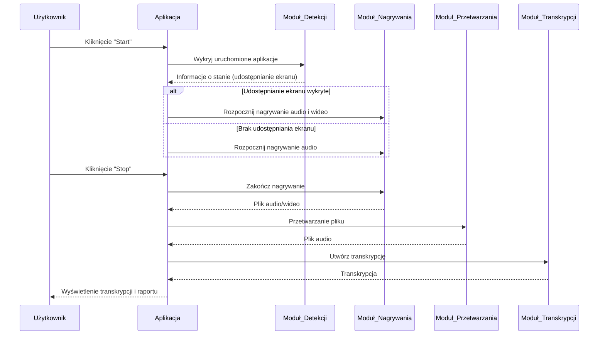
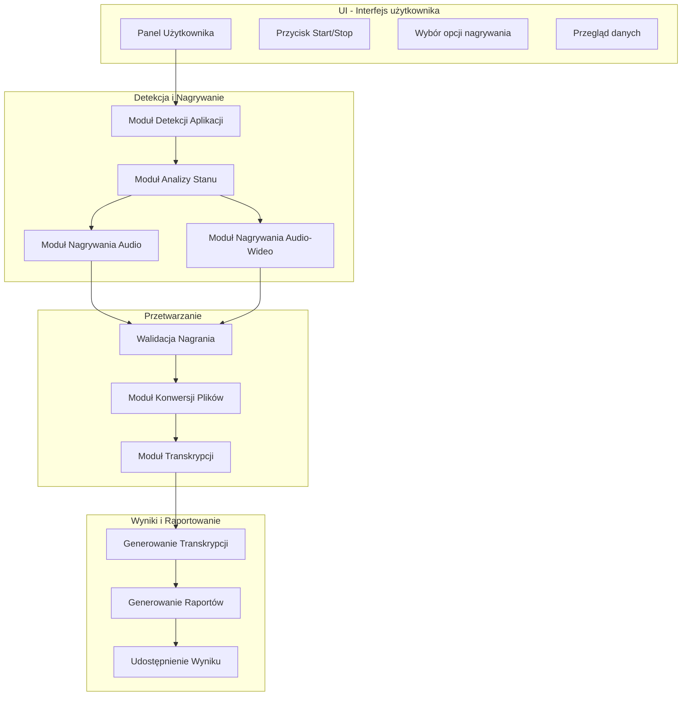

# Dokumentacja

## Członkowie zespołu

[członkowie.xlsx](https://github.com/user-attachments/files/17799235/czlonkowie.xlsx)

### Zestaw pytań

| Pytanie      | Odpowiedź                  | Uwagi|
| ------------- |:-------------------:| -----|
| Pytanie | Odpowiedź | Uwagi |
| Pytanie | Odpowiedź | Uwagi |
| Pytanie | Odpowiedź | Uwagi |
| Pytanie | Odpowiedź | Uwagi |
| Pytanie | Odpowiedź | Uwagi |
| Pytanie | Odpowiedź | Uwagi |
| Pytanie | Odpowiedź | Uwagi |

### Interfejs

### Przydatne biblioteki python

| Use case | Nazwa biblioteki                  | link do dok/tutorial yt |
| ------------- |:-------------------:| -----|
| Tworzenie GUI | tkinter | |
| x | x | x |
| x | x | x |
| x | x | x |

### Schemat przykładu użycia

### Diagram Sekwencyjny UML

### Projekt Architektury opracowanego systemu

### Sugerowane języki implementacji
Python

Uzasadnienie: Python jest doskonałym wyborem dla projektu nagrywania i transkrypcji dzięki swojej wszechstronności oraz bogatemu ekosystemowi bibliotek do obsługi multimediów, takich jak pyaudio, opencv, czy integracji z FFmpeg. Jako lider w dziedzinie sztucznej inteligencji, Python pozwala na łatwą integrację z zaawansowanymi API do transkrypcji, np. OpenAI Whisper czy Google Speech-to-Text, co przyspiesza wdrożenie funkcji przetwarzania dźwięku. Jego prostota i czytelność umożliwiają szybkie prototypowanie i rozwój aplikacji, a wsparcie dla systemowych bibliotek, takich jak psutil, pozwala na monitorowanie aplikacji i procesów systemowych.

