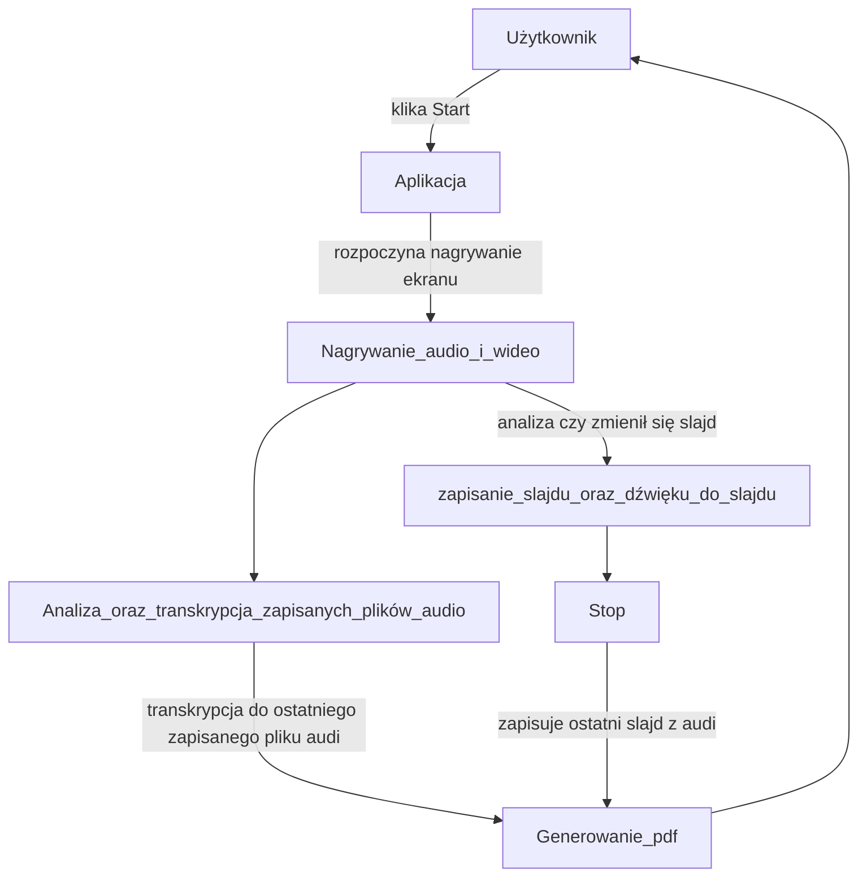
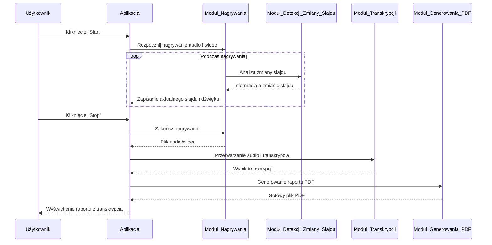
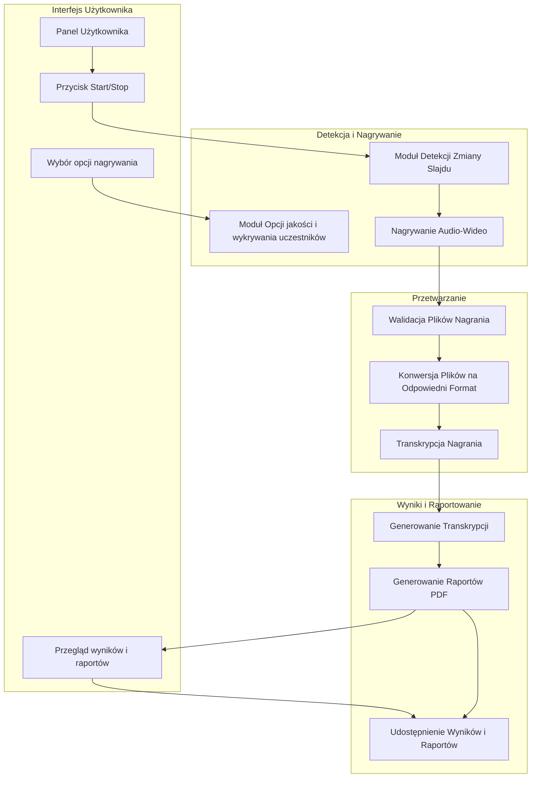

# łDokumentacja

## Członkowie zespołu

[członkowie.xlsx](https://github.com/user-attachments/files/17799235/czlonkowie.xlsx)

## Zestaw pytań

| Pytanie                                                                   | Odpowiedź                                                                                                     | Uwagi                                                                                                    |
| ------------------------------------------------------------------------- | -------------------------------------------------------------------------------------------------------------- | -------------------------------------------------------------------------------------------------------- |
| **Jak rozpocząć nagrywanie audio?**                               | Użyj funkcji `start_recording_audio()`.                                                                     | Można określić parametry `samplerate`, `channels` oraz opcjonalnie `duration`.                  |
| **Jak zatrzymać nagrywanie audio?**                                | Wywołaj funkcję `stop_recording_audio(output_file)`.                                                       | Jeśli podasz ścieżkę do `output_file`, nagranie zostanie zapisane jako plik WAV.                   |
| **Czy aplikacja obsługuje konwersję TXT do PDF?**                 | Tak, funkcja `txt_to_pdf_conversion()` w klasie `More` umożliwia konwersję plików `.txt` na `.pdf`. | Upewnij się, że plik `.txt` jest poprawny i zapisany w UTF-8.                                        |
| **Czy można wyświetlić plik PDF w aplikacji?**                   | Tak, funkcja `open_pdf()` w klasie `More` otwiera plik PDF w nowym oknie.                                  | Do wyświetlania PDF wykorzystywana jest biblioteka `tkinterPdfViewer`.                                |
| **Jak wybrać plik do konwersji lub wyświetlenia?**                | Użyj przycisków "Browse" w odpowiednich sekcjach GUI (dla TXT lub PDF).                                      | Ścieżka pliku jest aktualizowana w labelu poniżej przycisku "Browse".                                 |
| **Co się stanie, jeśli plik TXT jest pusty?**                     | Funkcja `txt_to_pdf_conversion` wygeneruje pusty plik PDF.                                                   | Warto sprawdzić zawartość pliku TXT przed rozpoczęciem konwersji.                                    |
| **Czy aplikacja obsługuje błędy podczas wybierania plików?**    | Tak, w przypadku błędów (np. brak pliku, niewłaściwy typ) aplikacja wyświetli komunikat błędu.         | Obsługa błędów wykorzystuje `messagebox.showerror`.                                                |
| **Czy aplikacja ma ograniczenia dotyczące rozmiaru plików PDF?**  | Nie widać w kodzie bezpośrednich ograniczeń dotyczących rozmiaru plików PDF.                              | Dla dużych plików wyświetlanie w `tkinterPdfViewer` może być mniej wydajne.                       |
| **Jak działa konwersja TXT do PDF?**                               | Funkcja `txt_to_pdf_conversion` odczytuje zawartość pliku TXT, dzieli tekst na linie i zapisuje do PDF.    | Każda linia jest ograniczona do 15 słów, co zapobiega wychodzeniu tekstu poza marginesy.              |
| **Jak aplikacja zapisuje wygenerowany PDF?**                        | Plik PDF jest zapisywany w tym samym katalogu co plik TXT, z tą samą nazwą i rozszerzeniem `.pdf`.        | Jeśli plik PDF już istnieje, zostanie nadpisany.                                                       |
| **Czy aplikacja obsługuje różne formaty audio?**                 | Nie, aplikacja obsługuje tylko format WAV dla nagrywania i zapisu.                                            | Możesz rozszerzyć aplikację, dodając konwersję do innych formatów, np. MP3 przy użyciu `pydub`. |
| **Jak działa GUI aplikacji?**                                      | GUI jest zbudowane za pomocą `tkinter` i rozszerzenia `ttkbootstrap`.                                     | Wszystkie operacje odbywają się w oknach głównych lub pomocniczych (`Toplevel`).                   |
| **Czy aplikacja pozwala na edycję ustawień?**                     | Tak, ustawienia są obsługiwane w module `Settings` (np. jakość obrazu).                                  | Szczegóły ustawień są przechowywane w obiekcie klasy `Settings`.                                   |
| **Czy aplikacja obsługuje wielozadaniowość?**                    | Tak, funkcje takie jak nagrywanie i transkrypcja działają w oddzielnych wątkach.                            | Wątki są obsługiwane za pomocą modułu `threading`.                                                |
| **Czy aplikacja umożliwia transkrypcję audio?**                   | Tak, kod sugeruje możliwość transkrypcji audio w module `transcription`.                                  | Funkcjonalność transkrypcji zależy od implementacji modułu `process_audio_file`.                   |
| **Czy aplikacja automatycznie generuje pdf po nagraniu spotkania?** | Tak, aplikacja automatycznie generuje plik pdf z transkrypcją i slajdami w folderze meetings.                 | Plik ten dodawany jest w specjalnym folderze `meetings` z datą oraz godziną skończenia nagrywania   |

## Interfejs

`<zaktualizowane zdjęcie>`

## Wykorzystane biblioteki python

| Use case                        | Nazwa biblioteki   | Link do dokumentacji/tutorialu                                                   |
| ------------------------------- | ------------------ | -------------------------------------------------------------------------------- |
| Tworzenie GUI                   | tkinter            | [Dokumentacja tkinter](https://docs.python.org/3/library/tkinter.html)              |
| Tworzenie GUI                   | ttkbootstrap       | [Dokumentacja ttkbootstrap](https://ttkbootstrap.readthedocs.io/)                   |
| Przetwarzanie obrazów          | cv2 (OpenCV)       | [Dokumentacja OpenCV](https://docs.opencv.org/)                                     |
| Manipulacja plikami audio       | pydub              | [Dokumentacja pydub](https://pydub.com/)                                            |
| Rozpoznawanie mowy              | speech_recognition | [Dokumentacja SpeechRecognition](https://github.com/Uberi/speech_recognition)       |
| Generowanie plików PDF         | fpdf               | [Dokumentacja FPDF](https://pyfpdf.github.io/fpdf2/)                                |
| Przeglądanie PDF w GUI         | tkinterPdfViewer   | [Dokumentacja tkinterPdfViewer](https://pypi.org/project/tkinter-pdf-viewer/)       |
| Obsługa systemu plików        | os, glob           | [Dokumentacja os](https://docs.python.org/3/library/os.html)                        |
| Automatyzacja GUI               | pyautogui          | [Dokumentacja pyautogui](https://pyautogui.readthedocs.io/)                         |
| Praca z plikami JSON            | json               | [Dokumentacja JSON](https://docs.python.org/3/library/json.html)                    |
| Przetwarzanie równoległe      | threading          | [Dokumentacja threading](https://docs.python.org/3/library/threading.html)          |
| Tworzenie wątków w tle        | threading          | [Dokumentacja threading](https://docs.python.org/3/library/threading.html)          |
| Nagrywanie dźwięku            | sounddevice        | [Dokumentacja sounddevice](https://python-sounddevice.readthedocs.io/)              |
| Zapisywanie plików audio       | scipy.io.wavfile   | [Dokumentacja scipy.io.wavfile](https://docs.scipy.org/doc/scipy/reference/io.html) |
| Przetwarzanie danych audio      | numpy              | [Dokumentacja numpy](https://numpy.org/doc/)                                        |
| Tworzenie plików PDF           | FPDF               | [Dokumentacja FPDF](https://pyfpdf.github.io/fpdf2/)                                |
| Przeglądanie plików PDF w GUI | tkinterPdfViewer   | [Dokumentacja tkinterPdfViewer](https://pypi.org/project/tkinter-pdf-viewer/)       |

## Schemat przykładu użycia

## Diagram Sekwencyjny UML

## Projekt Architektury opracowanego systemugraph TD;

## Szczegółowy opis funkcji aplikacji

<3 zdjęcia nowe interfejsu ui>

### **1. Funkcja nagrywania**

#### **Rozpocznij Nagrywanie**

- **Przycisk: "Start Recording"**
  - Rozpoczyna proces nagrywania ekranu i dźwięku.
  - Tworzy oddzielne wątki:
    - **Wątek Audio:**
      - Używa funkcji `start_recording_audio`, która rejestruje dźwięk w krótkich fragmentach.
      - Każdy fragment dźwięku jest synchronizowany z odpowiadającym mu zrzutem ekranu.
    - **Wątek Ekranu:**
      - Wykonuje zrzuty ekranu w regularnych odstępach czasu.
      - Każdy zrzut jest porównywany z poprzednim pod kątem zmian:
        - Zmiany są analizowane na podstawie różnic w pikselach.
        - Jeśli różnica przekracza określony próg (np. **15%**), zrzut ekranu jest uznawany za znaczący i zapisywany w folderze `whiteboard_data`.
      - Wszystkie zrzuty ekranu są zapisywane w folderze `data`, a istotne zmiany w folderze `whiteboard_data`.

#### **Mechanizm Porównywania Obrazów**

- **Algorytm porównywania:**
  - Obrazy są porównywane pod kątem różnic w pikselach.
  - Jeśli różnice między dwoma kolejnymi zrzutami są znaczące, nowy zrzut jest zapisywany jako istotny.
- **Synchronizacja Audio i Obrazu:**
  - Każdy istotny zrzut ekranu powoduje zatrzymanie obecnego nagrywania audio i rozpoczęcie nowego nagrania audio przypisanego do danego zrzutu.

#### **Ograniczenia Nagrywania**

- **Jakość Zrzutów:**
  - Użytkownik może dostosować jakość zapisywanych obrazów (np. `100%`, `90%`) w ustawieniach aplikacji.

#### **Zakończ Nagrywanie**

- **Przycisk: "Stop Recording"**
  - Zatrzymuje aktywne wątki nagrywania ekranu i dźwięku.
  - **Post-Processing:**
    - Wszystkie zrzuty ekranu z folderu `whiteboard_data` są łączone w film za pomocą FFmpeg.
    - Nagrania audio są synchronizowane z odpowiednimi fragmentami wideo.
    - Generowany jest pełny materiał wideo wraz z dźwiękiem.

#### **Przetwarzanie Raportu**

- Po zakończeniu nagrywania aplikacja generuje raport PDF:
  - Raport zawiera wszystkie istotne zrzuty ekranu.
  - Każdemu obrazowi towarzyszy transkrypcja nagrania audio przypisanego do danego zrzutu.
- Raport jest zapisywany w katalogu `meetings` z datą i godziną rozpoczęcia nagrania.

#### **Automatyczne Czyszczenie Danych**

- Przed rozpoczęciem nowego nagrywania wszystkie pliki w folderach `data` i `whiteboard_data` są usuwane, aby uniknąć nadpisywania starych danych.

### **2. Transkrypcja**

#### **Transkrypcja Pliku Audio**

- **Wybór Pliku Audio:**
  - Umożliwia użytkownikowi wybór pliku `.wav` z systemu lokalnego.
  - Ścieżka wybranego pliku jest wyświetlana w interfejsie aplikacji.
- **Wybór Języka:**
  - Użytkownik może wybrać język streszczania tekstu, np. `pl` (polski) lub `en-US` (angielski).
  - Wybrany język jest widoczny w aplikacji i używany w procesie streszczania.
- **Przetwarzanie Transkrypcji:**
  - Transkrypcja plików audio odbywa się w osobnym wątku.
  - Wykorzystuje kolejkę zadań (`transcription_queue`) do przetwarzania zgłoszonych plików.
  - Transkrypcje są generowane w formie plików tekstowych `.txt` i zapisywane w katalogu docelowym.

#### **Transkrypcja Podczas Nagrywania**

- Zrzuty ekranu oznaczone jako znaczące (przechowywane w folderze `whiteboard_data`) są łączone z krótkimi nagraniami audio.
- Transkrypcja jest przeprowadzana na bieżąco:
  - Każdy fragment audio przypisany do danego zrzutu ekranu jest przetwarzany.
  - Wyniki transkrypcji są przechowywane w plikach `.txt`, z których każdy odpowiada jednemu zrzutowi ekranu.

#### **Wynik Transkrypcji**

- Wszystkie transkrypcje są automatycznie uwzględniane w generowanym raporcie PDF:
  - Tekst z plików transkrypcji pojawia się poniżej odpowiadających im zrzutów ekranu.
  - Raport PDF jest zapisywany w katalogu docelowym z nazwą odpowiadającą czasowi rozpoczęcia nagrywania.

### **3. Zaawansowane opcje**

#### **Set Names**

- Otwiera okno, w którym można przypisać nazwy mówców.
- Umożliwia personalizację transkrypcji.

#### **Settings**

- Otwiera okno ustawień, gdzie użytkownik może dostosować:
  - **Jakość nagrywania:** Procentowa jakość (100%, 90%, itd.).
  - **Rozpoznawanie mówców:** Opcja włączania/wyłączania.

#### **More**

- Otwiera dodatkowe okno z zaawansowanymi funkcjami:
  - **Konwersja plików tekstowych do PDF**:

    - **Wybór pliku `.txt`:**
      - Umożliwia użytkownikowi wybór pliku tekstowego do konwersji na PDF.
      - Ścieżka do wybranego pliku jest wyświetlana w interfejsie.
      - Jeśli plik nie zostanie wybrany, pojawia się komunikat o błędzie.
    - **Przycisk "Convert":**
      - Tworzy plik PDF z zawartości pliku tekstowego.
      - Proces:
        - Każda linia pliku tekstowego jest dzielona na segmenty po 15 słów, aby zmieścić się w jednej linii PDF.
        - PDF jest zapisywany w tej samej lokalizacji co plik `.txt`, z rozszerzeniem `.pdf`.
      - Po zakończeniu procesu wyświetlany jest komunikat o sukcesie.
      - W przypadku błędu aplikacja informuje użytkownika za pomocą komunikatu o błędzie.
  - **Otwieranie plików PDF**:

    - **Wybór pliku `.pdf`:**
      - Umożliwia użytkownikowi wybór pliku PDF do wyświetlenia.
      - Ścieżka do wybranego pliku jest wyświetlana w interfejsie.
      - Jeśli plik nie zostanie wybrany, pojawia się komunikat o błędzie.
    - **Przycisk "Open":**
      - Otwiera nowy widok w oknie aplikacji, wyświetlający zawartość wybranego pliku PDF.
      - Widok PDF:
        - Umożliwia użytkownikowi przeglądanie zawartości pliku w formacie PDF.
        - Plik jest wyświetlany w interfejsie za pomocą modułu `tkinterPdfViewer`.

---

### **4. Status nagrywania**

- **Wskaźnik statusu:**
  - Aktualizowany co **200 ms**.
  - **Czerwony punkt:** Oznacza aktywne nagrywanie.
  - **Szary punkt:** Oznacza brak nagrywania.

---

### **5. Mechanizmy zarządzania danymi**

- **Czyszczenie danych:**
  - Przy rozpoczęciu nowego nagrywania wszystkie pliki w katalogach `data` i `whiteboard_data` są automatycznie usuwane.

---

### **6. Limity przechowywania**

- **Obliczenia czasu nagrywania:**
  - Uwzględniane parametry:
    - **Jakość wideo:** Wpływa na rozmiar zrzutów ekranu.

## Sugerowane języki implementacji

Python

Uzasadnienie: Python jest doskonałym wyborem dla projektu nagrywania i transkrypcji dzięki swojej wszechstronności oraz bogatemu ekosystemowi bibliotek do obsługi multimediów, takich jak pyaudio, opencv, czy integracji z FFmpeg. Jako lider w dziedzinie sztucznej inteligencji, Python pozwala na łatwą integrację z zaawansowanymi API do transkrypcji, np. OpenAI Whisper czy Google Speech-to-Text, co przyspiesza wdrożenie funkcji przetwarzania dźwięku. Jego prostota i czytelność umożliwiają szybkie prototypowanie i rozwój aplikacji, a wsparcie dla systemowych bibliotek, takich jak psutil, pozwala na monitorowanie aplikacji i procesów systemowych.
